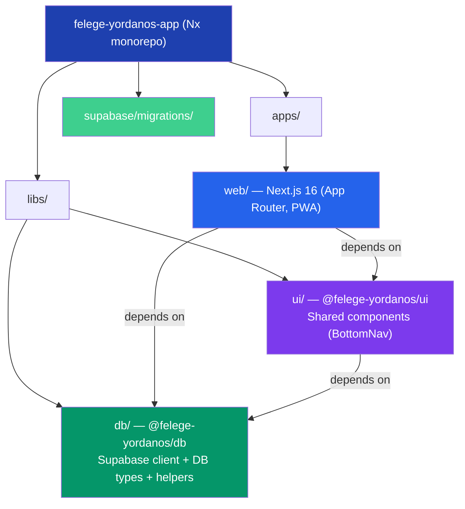
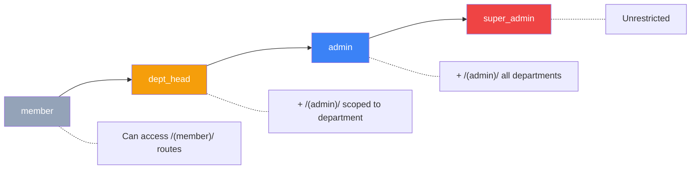

# Architecture Overview

## Monorepo Structure



## Tech Stack

| Layer | Choice |
|-------|--------|
| Monorepo | Nx 22 |
| App | Next.js 16 (App Router) |
| Language | TypeScript (strict) |
| Styling | Tailwind CSS + shadcn/ui |
| UI Components | shadcn/ui (Card, Button, Input, Label, Badge, DropdownMenu, Toast, etc.) |
| Backend/DB | Supabase (PostgreSQL) |
| Auth | Supabase Auth via `@supabase/ssr` |
| Mobile | PWA (`@ducanh2912/next-pwa`) |
| Package Manager | pnpm 10 |

## Role System



Roles are stored in the `profiles` table (column: `role`). Department scoping uses `department_id`. A database trigger auto-creates a profile with `role = 'member'` on sign-up.

## Web App File Layout

```
apps/web/
├── app/
│   ├── layout.tsx              # Root layout (html, body, metadata, Toaster)
│   ├── page.tsx                # / — redirects to /dashboard
│   ├── global.css              # Tailwind + shadcn/ui CSS variables
│   ├── manifest.json           # PWA web app manifest
│   ├── favicon.ico             # Browser tab icon
│   ├── icon0.svg, icon1.png    # Additional icons (auto-detected)
│   ├── apple-icon.png          # Apple touch icon (auto-detected)
│   ├── (public)/               # No auth required
│   │   ├── layout.tsx
│   │   └── login/page.tsx      # Sign-in / sign-up form (shadcn/ui)
│   ├── (member)/               # Authenticated users
│   │   ├── layout.tsx          # Fetches profile, UserMenu + BottomNav
│   │   ├── dashboard/page.tsx  # Greeting, claim prompt, quick links
│   │   ├── claim/
│   │   │   ├── page.tsx        # Server wrapper
│   │   │   └── claim-form.tsx  # Member ID claim form
│   │   ├── profile/
│   │   │   ├── page.tsx        # Server wrapper (fetches profile + member)
│   │   │   └── profile-form.tsx # Editable display name + linked member info
│   │   ├── attendance/page.tsx
│   │   ├── donate/page.tsx
│   │   └── songbook/
│   │       ├── page.tsx        # Server: fetches songs + categories
│   │       ├── song-list.tsx   # Client: search, filter, song cards
│   │       └── [id]/page.tsx   # Server: single song lyrics
│   └── (admin)/                # dept_head, admin, super_admin
│       ├── layout.tsx          # Fetches profile, UserMenu + BottomNav
│       └── admin/
│           ├── page.tsx
│           ├── users/page.tsx
│           ├── attendance/
│           │   ├── page.tsx
│           │   └── [eventId]/page.tsx
│           └── donations/page.tsx
├── components/
│   ├── ui/                     # shadcn/ui components (17 components)
│   ├── user-menu.tsx           # DropdownMenu with Profile + Sign out
│   └── logout-button.tsx       # Standalone sign-out button (legacy)
├── hooks/                      # Custom hooks (use-toast)
├── lib/utils.ts                # cn() utility
├── proxy.ts                    # Auth proxy (Next.js 16 convention)
├── public/                     # Static assets
│   ├── web-app-manifest-192x192.png
│   └── web-app-manifest-512x512.png
└── next.config.js              # withNx + withPWA plugins

libs/db/src/
├── client.ts                   # createClient(), createServerComponentClient()
├── members.ts                  # getLinkedMember() helper
├── types.ts                    # Database types (profiles, members, songs, categories)
└── index.ts                    # Barrel exports

supabase/migrations/
├── 001_create_profile_trigger.sql  # profiles table + auto-create trigger
├── 002_profiles_rls.sql            # RLS policies + get_my_role() helper
├── 003_seed_songs.sql              # categories + songs tables + seed data
├── 004_songs_rls.sql               # RLS for songs/categories
└── 004b_member_auth_link.sql       # auth_user_id on members + RLS
```
