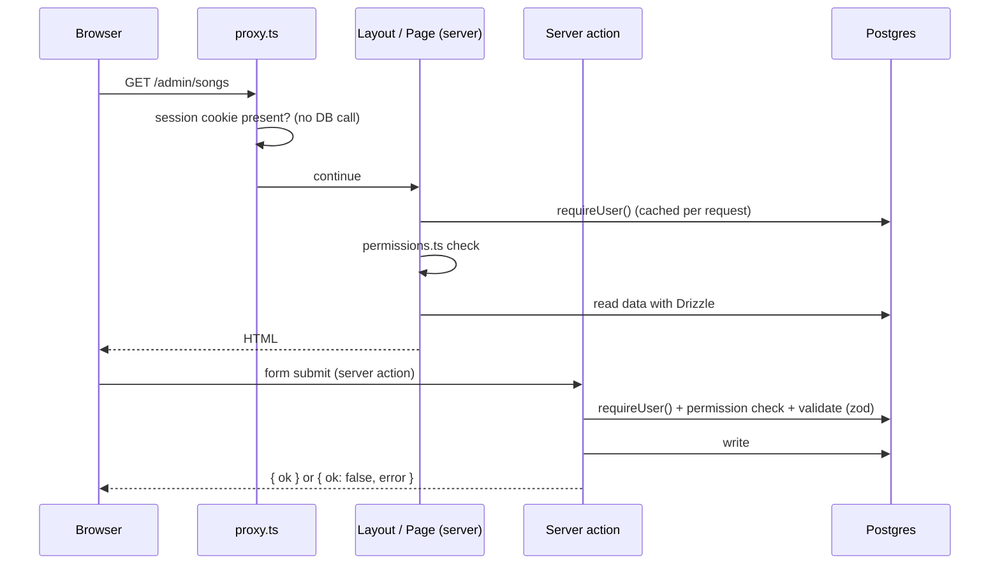

# Architecture Overview

## Monorepo structure

```
felege-yordanos-app/          Nx monorepo, pnpm workspaces
  apps/web/                   Next.js 16 (App Router, PWA)
    app/(public)/             login, forgot-password, reset-password
    app/(member)/             any signed-in user
    app/(admin)/              dept_head, admin, super_admin
    app/api/auth/[...all]/    Better Auth endpoints
    app/api/receipts/[...key] donation receipt files (permission-checked)
    lib/auth.ts               Better Auth server config
    lib/auth-client.ts        Better Auth browser client
    lib/session.ts            getCurrentUser / requireUser / requireRole
    lib/permissions.ts        every authorization rule
    lib/storage.ts            file uploads on local disk
    lib/action-result.ts      return type for server actions
    proxy.ts                  fast cookie check (not the security boundary)
  libs/db/                    Drizzle schema, migrations, seed, server db client
  libs/ui/                    shared UI (BottomNav)
  docker-compose.yml          local Postgres 17
```

## Tech stack

| Layer | Choice |
|---|---|
| Monorepo | Nx 22, pnpm 10 |
| App | Next.js 16 App Router, React 19, TypeScript strict |
| Styling | Tailwind CSS + shadcn/ui |
| Database | PostgreSQL 17 + Drizzle ORM (`libs/db`) |
| Auth | Better Auth (email + password), sessions in Postgres |
| Files | Local disk (`UPLOAD_DIR`), served through permission-checked route |
| Mobile | PWA (`@ducanh2912/next-pwa`) |
| Hosting (target) | Own VPS, Docker, Kamal 2 (Phase 1) |

## How a request works



Rules:
- All data access happens on the server (pages and server actions). Client components never talk to the database.
- Every page and every action checks permissions with `lib/permissions.ts`. Hiding a button is not security.
- Server actions validate input with zod and return `ActionResult`.

## Role system

| Role | Access |
|---|---|
| member | member screens |
| dept_head | + admin screens for their department |
| admin | + all departments |
| super_admin | + user management |

Special departments (see `DEPARTMENT` in `lib/permissions.ts`): 3 Programs & Events (reads all attendance), 6 Songs (manages songbook), 9 Budget (reviews donations).

## Branches and environments

| Branch | Environment |
|---|---|
| `feat/*`, `fix/*` | local |
| `dev` | staging (Phase 1) |
| `main` | production |

Production on `main` still runs the old Vercel + Supabase version until the cutover. Do not merge `dev` into `main` before the new server is live.
