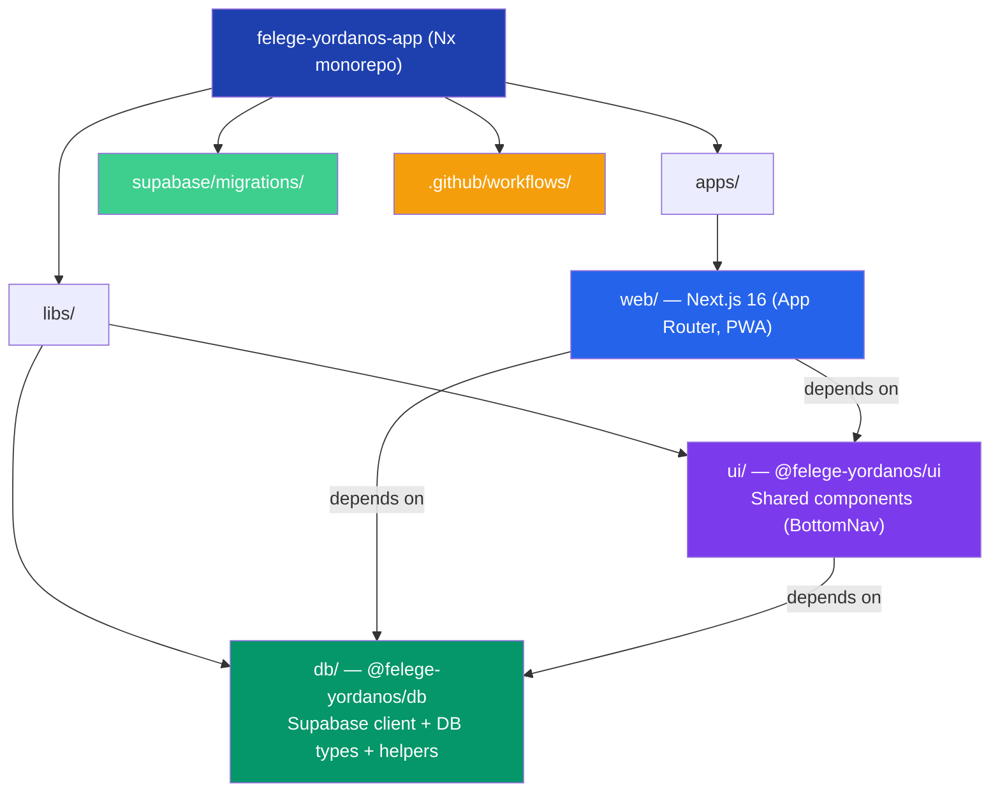
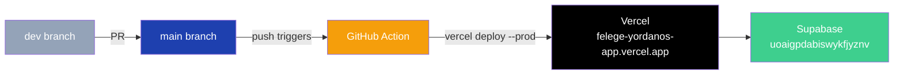
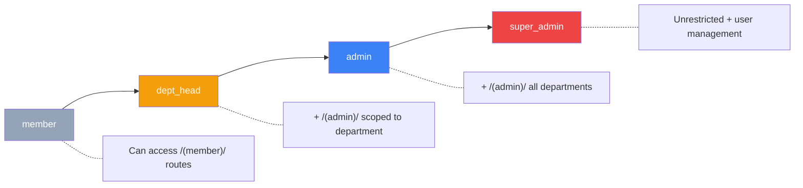

# Architecture Overview

## Monorepo Structure



## Tech Stack

| Layer | Choice |
|-------|--------|
| Monorepo | Nx 22 |
| App | Next.js 16 (App Router) |
| Language | TypeScript (strict) |
| Styling | Tailwind CSS + shadcn/ui |
| UI Components | shadcn/ui (Card, Button, Input, Label, Badge, Table, Sheet, Dialog, Select, Tabs, Toast, DropdownMenu, Textarea, Separator, Avatar, Form) |
| Backend/DB | Supabase (PostgreSQL + Storage) |
| Auth | Supabase Auth via `@supabase/ssr` |
| Mobile | PWA (`@ducanh2912/next-pwa`) — installable, standalone |
| Hosting | Vercel (free Hobby tier, CLI deploy) |
| CI/CD | GitHub Actions → Vercel auto-deploy on push to main |
| Package Manager | pnpm 10 |

## Deployment



**Workflow:**
1. Develop on `dev` branch (or feature branches)
2. Create PR to merge into `main`
3. Merge → GitHub Action auto-deploys to Vercel production
4. Manual deploy: `vercel --archive=tgz --prod`

**Environment variables (set in Vercel dashboard):**
- `NEXT_PUBLIC_SUPABASE_URL`
- `NEXT_PUBLIC_SUPABASE_ANON_KEY`

**GitHub secrets (for CI/CD):**
- `VERCEL_TOKEN` — from vercel.com/account/tokens
- `VERCEL_ORG_ID` — from `.vercel/project.json`
- `VERCEL_PROJECT_ID` — from `.vercel/project.json`

## Role System



Roles are stored in the `profiles` table (column: `role`). Department scoping uses `department_id`. A database trigger auto-creates a profile with `role = 'member'` on sign-up. Super admins manage roles via `/admin/users`.

## Web App File Layout

```
apps/web/
├── app/
│   ├── layout.tsx              # Root layout (metadata, Apple PWA, Toaster)
│   ├── page.tsx                # / — landing page (public) or redirect to /dashboard
│   ├── global.css              # Tailwind + shadcn/ui CSS variables
│   ├── manifest.json           # PWA manifest (ፈለገ ዮርዳኖስ, standalone)
│   ├── favicon.ico, icon0.svg, icon1.png, apple-icon.png
│   ├── (public)/               # No auth required
│   │   ├── layout.tsx
│   │   └── login/page.tsx      # Sign-in / sign-up form
│   ├── (member)/               # Authenticated users
│   │   ├── layout.tsx          # Fetches profile → UserMenu + BottomNav
│   │   ├── dashboard/
│   │   │   ├── page.tsx        # Greeting, events feed, claim prompt, quick links
│   │   │   └── event-feed.tsx  # Client: dept filter badges, upcoming/past events
│   │   ├── claim/
│   │   │   ├── page.tsx
│   │   │   └── claim-form.tsx  # Link auth account to member record
│   │   ├── profile/
│   │   │   ├── page.tsx
│   │   │   └── profile-form.tsx # Display name, role, linked member info
│   │   ├── songbook/
│   │   │   ├── page.tsx        # Server: fetches songs + categories
│   │   │   ├── song-list.tsx   # Client: search, category filter, song cards
│   │   │   └── [id]/page.tsx   # Server: single song lyrics
│   │   ├── attendance/page.tsx # Personal attendance history (or claim prompt)
│   │   └── donate/
│   │       ├── page.tsx        # Server: fetches past donations
│   │       └── donate-form.tsx # Client: amount, method, receipt upload, history
│   └── (admin)/                # dept_head, admin, super_admin
│       ├── layout.tsx          # Redirects members, role badge, UserMenu + BottomNav
│       └── admin/
│           ├── page.tsx        # Navigation cards (Attendance, Donations, Users)
│           ├── users/
│           │   ├── page.tsx    # Super admin: profiles table + access denied
│           │   └── users-table.tsx # Search, role/dept Sheet editor
│           ├── attendance/
│           │   ├── page.tsx    # Event list + create dialog
│           │   ├── events-list.tsx # Table, create/edit, dept filter
│           │   └── [eventId]/
│           │       ├── page.tsx
│           │       └── check-in-tabs.tsx # Member List + Quick Check-in tabs
│           └── donations/
│               ├── page.tsx    # All donations table
│               └── donations-table.tsx # Status filter, verify/reject, receipt viewer
├── components/
│   ├── ui/                     # shadcn/ui components (17 components)
│   ├── user-menu.tsx           # DropdownMenu with Profile + Sign out
│   └── logout-button.tsx       # Standalone sign-out (legacy)
├── hooks/use-toast.ts
├── lib/utils.ts                # cn() utility
├── proxy.ts                    # Auth proxy (Next.js 16)
├── public/                     # PWA icons
└── next.config.js              # withNx + withPWA

libs/db/src/
├── client.ts                   # createClient(), createServerComponentClient()
├── members.ts                  # getLinkedMember() helper
├── types.ts                    # Database types (all tables)
└── index.ts                    # Barrel exports

supabase/migrations/
├── 001_create_profile_trigger.sql
├── 002_profiles_rls.sql
├── 003_seed_songs.sql
├── 004_songs_rls.sql
├── 004b_member_auth_link.sql
├── 005_departments.sql
├── 006_attendance_tables.sql
├── 007_attendance_rls.sql
├── 008_donations_table.sql
├── 008b_storage_policies.sql
└── 009_donations_rls.sql

.github/workflows/
└── deploy.yml                  # Auto-deploy to Vercel on push to main

vercel.json                     # Build/install commands for Vercel
.vercelignore                   # Exclude node_modules, .nx, dist
```
