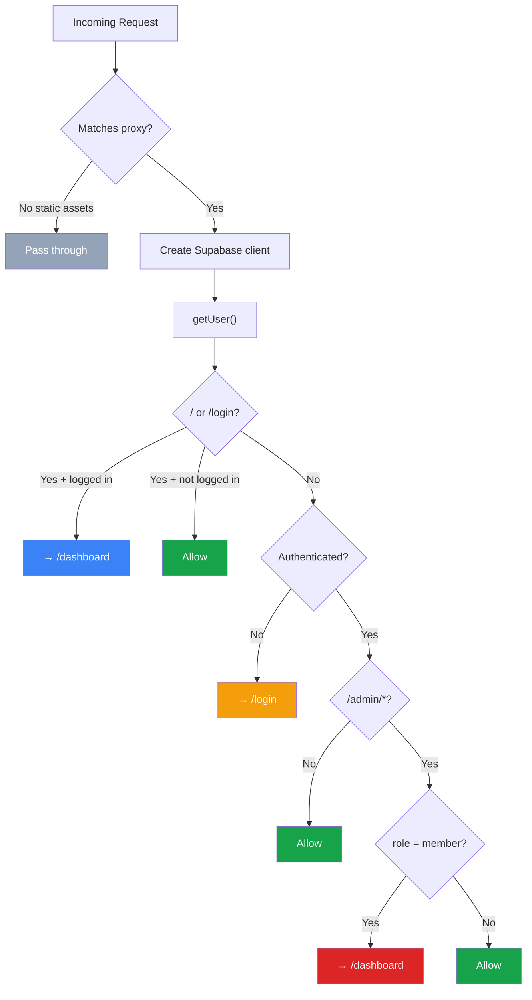
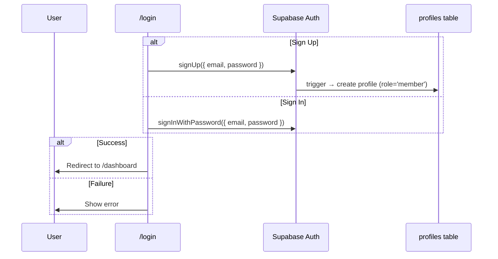
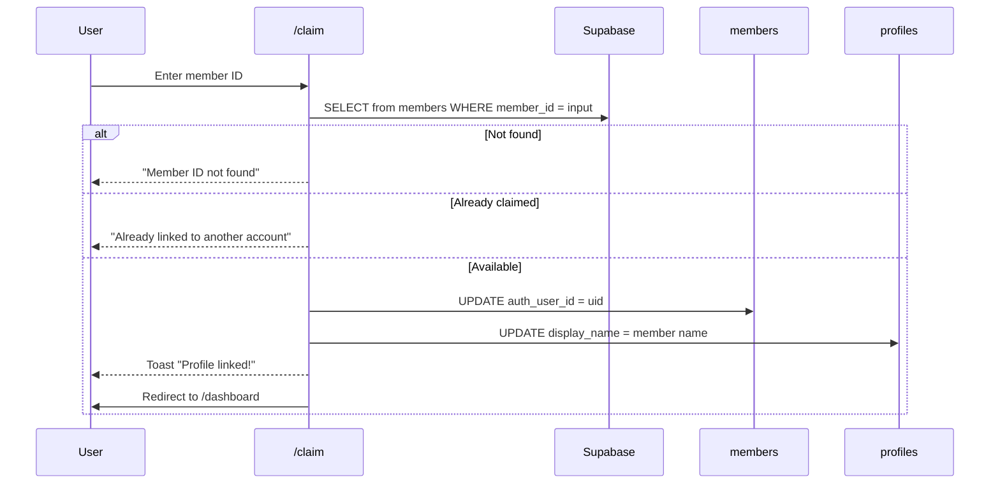
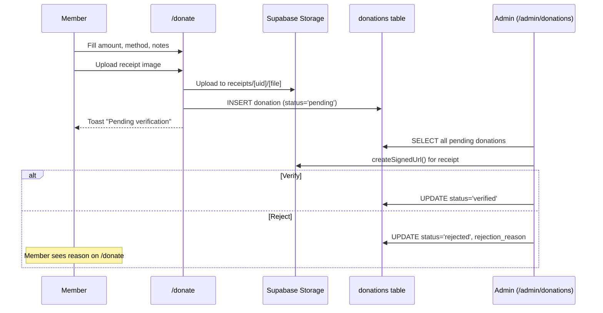
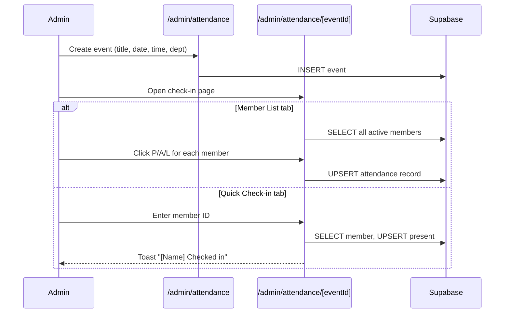

> **Outdated:** this describes the old Supabase Auth flow. Auth now uses Better Auth: see `apps/web/lib/auth.ts`, `apps/web/lib/session.ts` and `apps/web/proxy.ts`. The RLS tables below are still the reference for the permission rules each screen must enforce when ported.

# Authentication & Authorization Flow

## Proxy Request Flow

`proxy.ts` (Next.js 16 convention) runs on every request except static assets.



## Login / Sign-Up Flow



## Member Claim Flow



## Donation Flow



## Attendance Flow



## Access Control Summary

```mermaid
graph TD
    subgraph ROLES["Role → Access"]
        direction LR
        ANON["Anonymous"] -->|"/ and /login only"| PUB["Public"]
        MEMBER_R["member"] -->|all member routes| MEM["Member"]
        DH["dept_head"] -->|+ admin routes (own dept)| ADM["Admin"]
        ADMIN_R["admin"] -->|+ admin routes (all depts)| ADM
        SA["super_admin"] -->|+ user management| ALL["Everything"]
    end

    style ANON fill:#94a3b8,color:#fff
    style MEMBER_R fill:#94a3b8,color:#fff
    style DH fill:#f59e0b,color:#fff
    style ADMIN_R fill:#3b82f6,color:#fff
    style SA fill:#ef4444,color:#fff
```

## RLS Policy Summary

| Table | SELECT | INSERT | UPDATE | DELETE |
|-------|--------|--------|--------|--------|
| profiles | Own + admins (via get_my_role) | Trigger only | Own + super_admin | — |
| members | All authenticated | — | Claim unclaimed + admins | — |
| categories | Authenticated | — | — | — |
| songs | Authenticated | Admin/super_admin | Admin/super_admin | Admin/super_admin |
| departments | Authenticated | Super_admin | Super_admin | Super_admin |
| events | Authenticated | Dept_head (own) + admin | Creator + admin | Creator + admin |
| attendance | Own + dept_head/admin | Dept_head (own) + admin | Dept_head (own) + admin | — |
| donations | Own + admin + Budget dept | Own (donor_id) | Admin + Budget dept | — |
| storage:receipts | Own folder + admin + Budget dept | Own folder | — | — |
