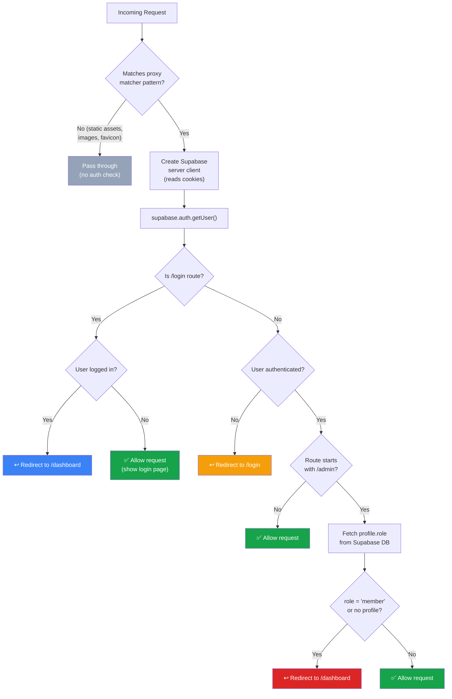
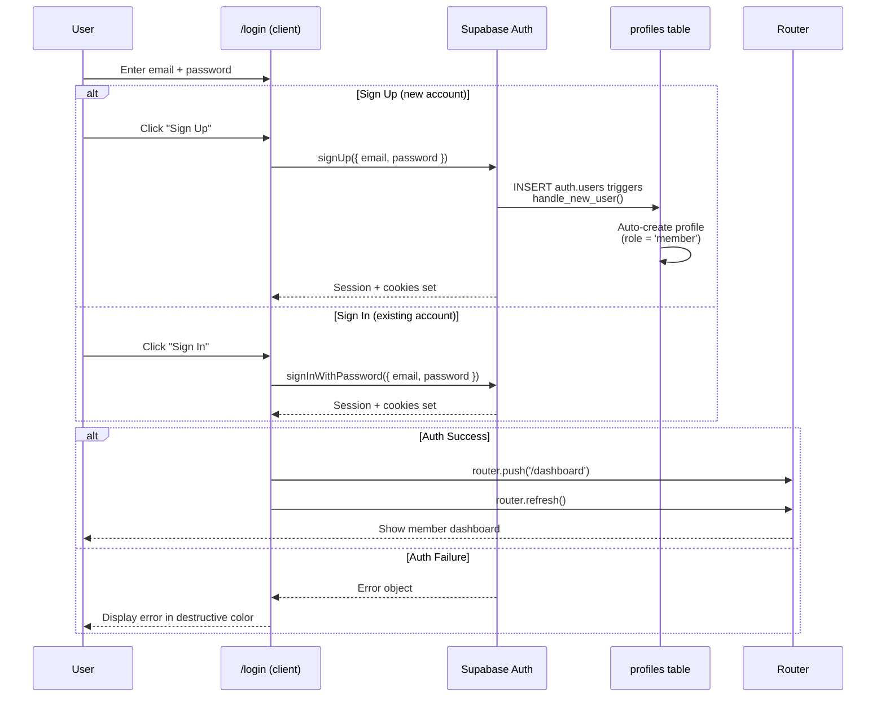
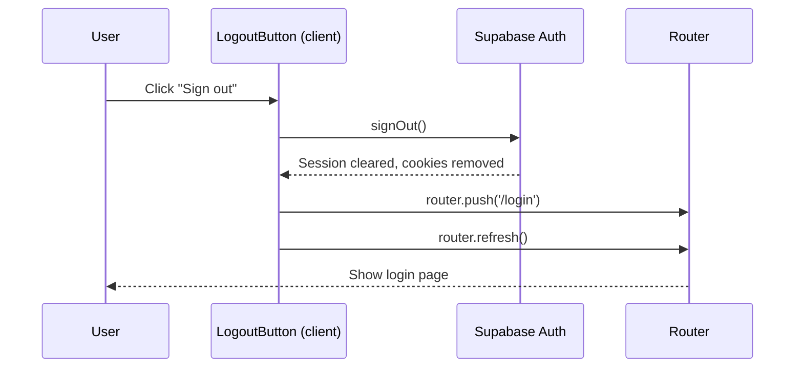
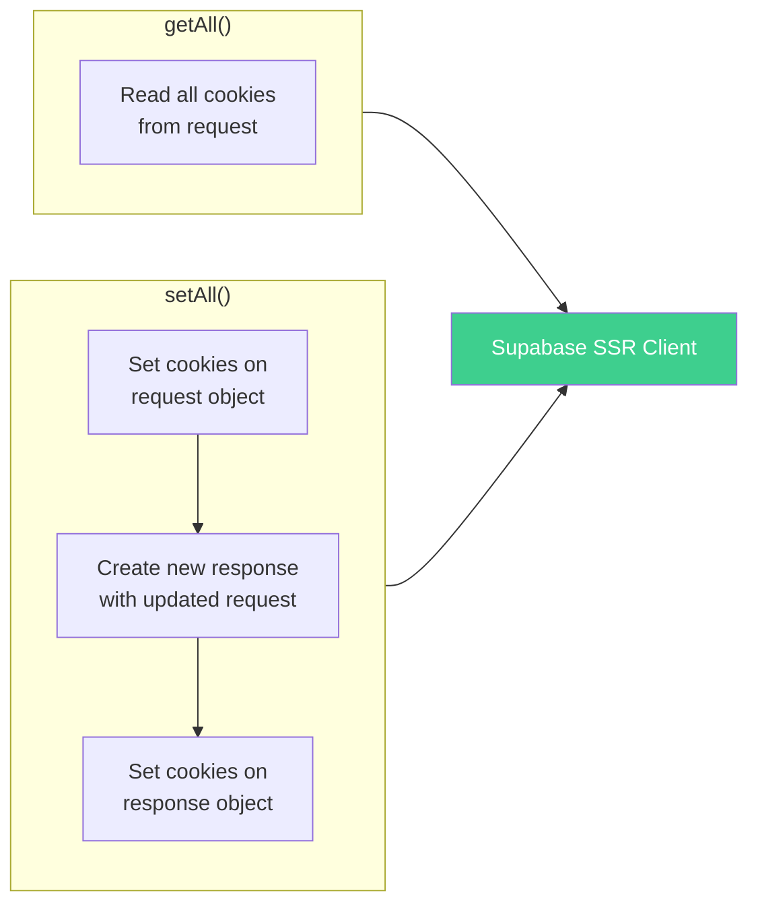
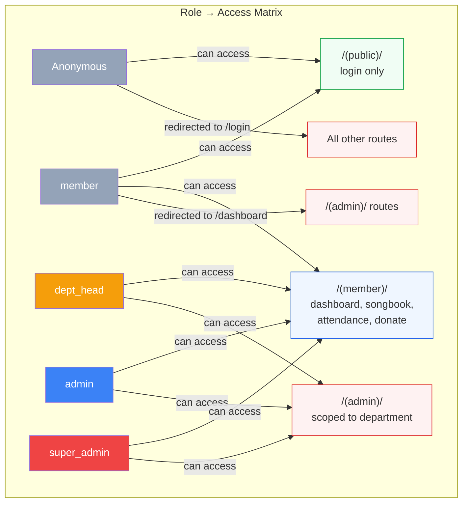
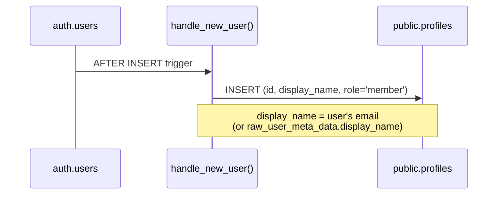

# Authentication & Authorization Flow

## Proxy (Middleware) Request Flow

The `proxy.ts` file (Next.js 16 convention, replaces `middleware.ts`) runs on every request except static assets. It handles auth checks before the page renders.

## Proxy Matcher

The proxy skips these patterns (no auth overhead):
- `_next/static/*` — Next.js static assets
- `_next/image/*` — Next.js image optimization
- `favicon.ico` — Browser icon
- `manifest.json`, `manifest.webmanifest` — PWA manifest
- `*.svg`, `*.png`, `*.jpg`, `*.jpeg`, `*.gif`, `*.webp` — Image files

## Login / Sign-Up Flow

## Logout Flow

## Cookie Management

The proxy manages Supabase auth cookies on every request:

This ensures auth tokens are refreshed transparently on every request, keeping the session alive without user interaction.

## Access Control Summary

## Database: Profile Auto-Creation

When a user signs up, a PostgreSQL trigger automatically creates their profile:

## RLS Policies on profiles

| Policy | Operation | Who | Condition |
|--------|-----------|-----|-----------|
| Read own profile | SELECT | Any user | `auth.uid() = id` |
| Read all profiles | SELECT | admin, super_admin | Role check via subquery |
| Update own profile (except role) | UPDATE | Any user | `auth.uid() = id` AND role unchanged |
| Update any profile | UPDATE | super_admin | Role check via subquery |

> **Note:** Department-level scoping for `dept_head` is planned but not yet enforced at the proxy level. Currently, the proxy only checks that the role is not `member` for `/admin/*` routes. Finer-grained department scoping will be handled via Supabase RLS policies on the database.
