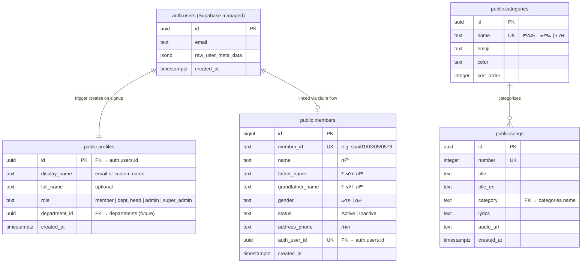
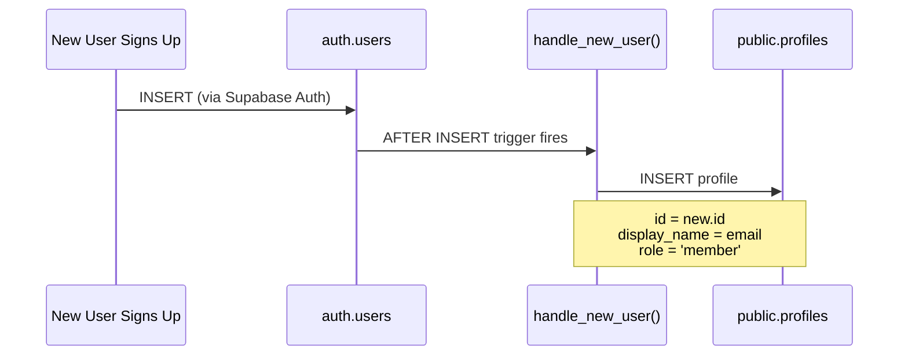
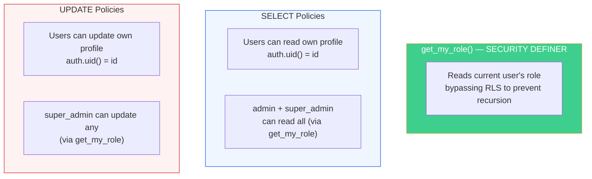
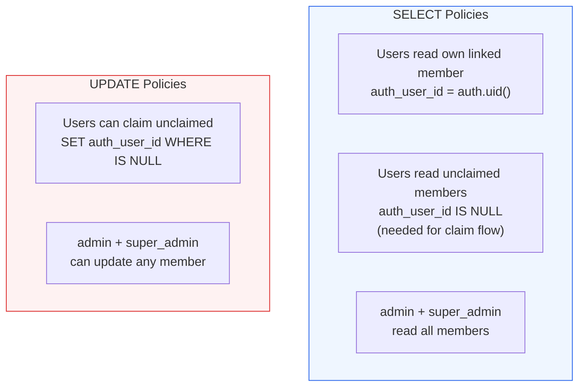
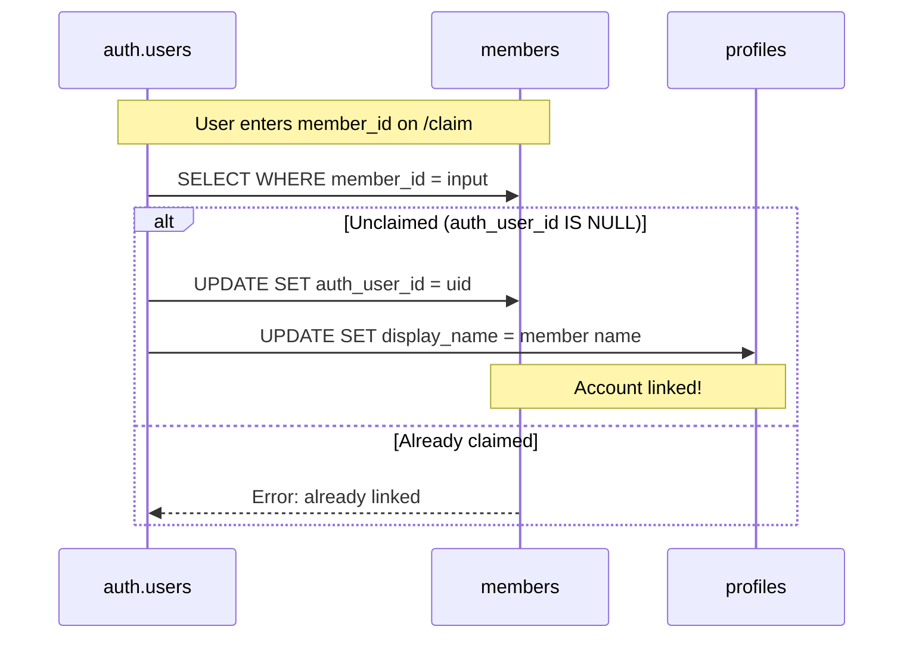
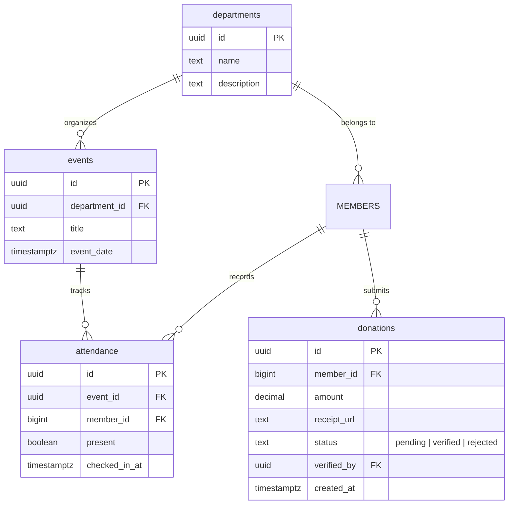

# Database Schema & Migrations

## Overview

The app uses Supabase (PostgreSQL) with Row Level Security (RLS). The database is managed separately via the Supabase dashboard — SQL migrations are stored in `supabase/migrations/` and run manually.

## Entity Relationship

## Migrations

### 001_create_profile_trigger.sql

Creates the `profiles` table and a trigger that auto-creates a profile when a user signs up:

**Key details:**
- `id` references `auth.users(id)` with `ON DELETE CASCADE`
- `role` has a CHECK constraint: must be one of `member`, `dept_head`, `admin`, `super_admin`
- Function uses `SECURITY DEFINER` with empty `search_path` for safety
- RLS is enabled on the table

### 002_profiles_rls.sql

RLS policies for profiles using `get_my_role()` SECURITY DEFINER helper to avoid infinite recursion:

### 003_seed_songs.sql

Creates `categories` and `songs` tables with seed data:
- 3 categories: ምስጋና (Praise), ዝማሬ (Worship), ተስፋ (Hope)
- 5 sample songs with Amharic lyrics

### 004_songs_rls.sql

RLS for songs and categories:

| Table | Operation | Who | Condition |
|-------|-----------|-----|-----------|
| categories | SELECT | Authenticated users | `auth.role() = 'authenticated'` |
| songs | SELECT | Authenticated users | `auth.role() = 'authenticated'` |
| songs | INSERT/UPDATE/DELETE | admin, super_admin | Role check via profiles subquery |

### 004b_member_auth_link.sql

Adds `auth_user_id` column to the existing `members` table for linking auth accounts to member records:

## Member Claim Flow (Data)

## Helper Functions

### get_my_role() (SQL)
- `SECURITY DEFINER` function that reads the current user's role bypassing RLS
- Prevents infinite recursion in RLS policies that need to check the user's role
- Used by profiles, members, and songs RLS policies

### getLinkedMember() (TypeScript)
- Located in `libs/db/src/members.ts`
- Queries `members WHERE auth_user_id = authUserId`
- Returns the full `Member` record or `null`
- Used by dashboard, profile page, and future modules (attendance, donations)

## Future Tables (Planned)

> **Note:** Future tables will reference `members.id` (not `profiles.id`) for attendance and donations, since these are tied to the Sunday School member record. The `department_id` column on `profiles` exists but has no FK constraint yet — it will reference the `departments` table once created.
