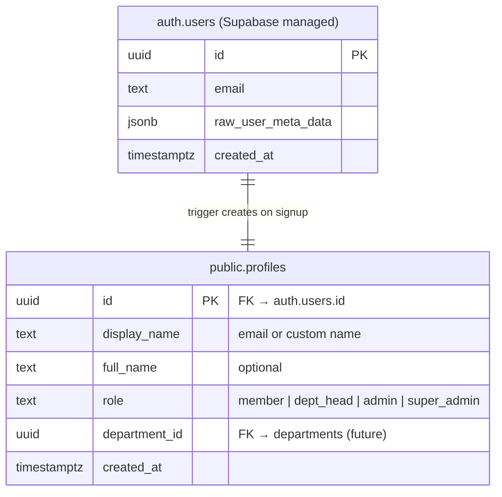
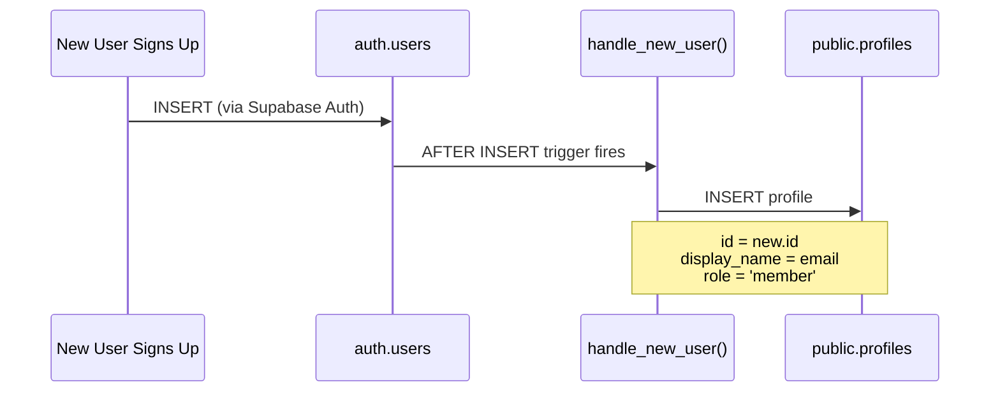
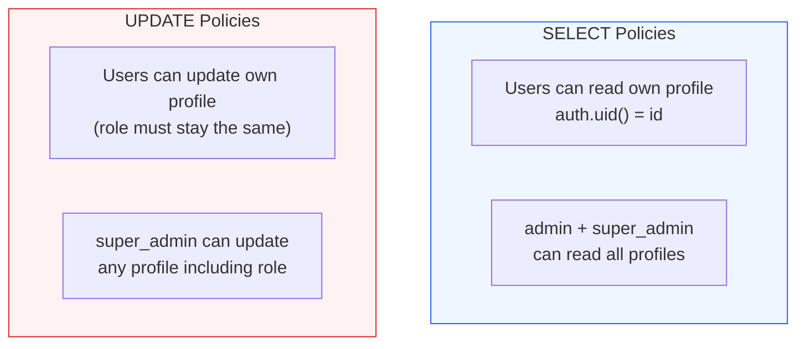

# Database Schema & Migrations

## Overview

The app uses Supabase (PostgreSQL) with Row Level Security (RLS). The database is managed separately via the Supabase dashboard — SQL migrations are stored in `supabase/migrations/` and run manually.

## Entity Relationship



## Migrations

### 001_create_profile_trigger.sql

Creates the `profiles` table and a trigger that auto-creates a profile when a user signs up:



**Key details:**
- `id` references `auth.users(id)` with `ON DELETE CASCADE`
- `role` has a CHECK constraint: must be one of `member`, `dept_head`, `admin`, `super_admin`
- Function uses `SECURITY DEFINER` with empty `search_path` for safety
- RLS is enabled on the table

### 002_profiles_rls.sql

Four RLS policies controlling who can read and update profiles:



**Role escalation prevention:** The "update own profile" policy uses a `WITH CHECK` that verifies the role column hasn't changed:
```sql
role = (SELECT p.role FROM profiles p WHERE p.id = auth.uid())
```

## Future Tables (Planned)


> **Note:** Future tables are planned but not yet created. The `department_id` column on `profiles` exists but has no foreign key constraint yet — it will reference the `departments` table once created.
