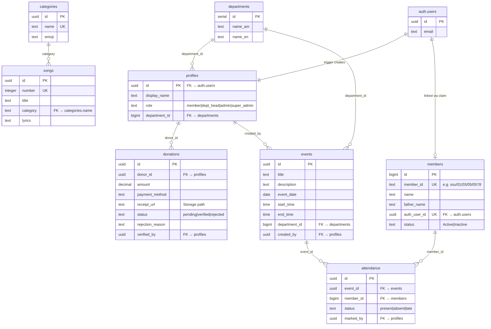

# Database Schema & Migrations

## Overview

The app uses Supabase (PostgreSQL + Storage) with Row Level Security (RLS). SQL migrations are stored in `supabase/migrations/` and run manually via the Supabase SQL Editor.

## Entity Relationship

## Migrations

### 001_create_profile_trigger.sql
- Creates `profiles` table with role CHECK constraint
- `handle_new_user()` trigger: auto-creates profile on signup with `role='member'`

### 002_profiles_rls.sql
- `get_my_role()` SECURITY DEFINER helper (prevents RLS recursion)
- SELECT: own profile + admins read all
- UPDATE: own profile + super_admin update any

### 003_seed_songs.sql
- Creates `categories` table (name, emoji, color, sort_order)
- Creates `songs` table (number, title, title_en, category FK, lyrics)
- Seeds 3 categories (ምስጋና, ዝማሬ, ተስፋ) and 5 sample songs

### 004_songs_rls.sql
- SELECT: authenticated users on both tables
- INSERT/UPDATE/DELETE on songs: admin/super_admin only

### 004b_member_auth_link.sql
- Adds `auth_user_id` column to `members` table
- SELECT: all authenticated users can read members
- UPDATE: users can claim unclaimed records, admins update any

### 005_departments.sql
- Creates `departments` table, seeds 9 SS departments
- FK from profiles.department_id to departments.id
- SELECT: authenticated users; manage: super_admin only

### 006_attendance_tables.sql
- Creates `events` table (title, description, date, start_time, end_time, department_id, created_by)
- Creates `attendance` table (event_id, member_id, status, marked_by, unique constraint)
- Indexes for fast lookups

### 007_attendance_rls.sql
- Events SELECT: all authenticated users
- Events INSERT: dept_head (own dept) + admin/super_admin
- Events UPDATE/DELETE: creator + admin/super_admin
- Attendance SELECT: own records + dept_head/admin/super_admin
- Attendance INSERT/UPDATE: dept_head (own dept events) + admin/super_admin

### 008_donations_table.sql
- Creates `donations` table (donor_id, amount, currency, payment_method, receipt_url, status, rejection_reason, verified_by/at)
- Indexes on donor_id and status

### 008b_storage_policies.sql
- Storage bucket: `receipts` (private, 5MB, JPEG/PNG/PDF)
- Upload: users to own folder (`receipts/[uid]/*`)
- Read: own receipts + admin/super_admin + Budget dept head (dept 9)

### 009_donations_rls.sql
- SELECT: own donations + admin/super_admin + Budget dept head
- INSERT: authenticated users (own donor_id)
- UPDATE: admin/super_admin + Budget dept head (for verify/reject)

## Helper Functions

### get_my_role() (SQL)
SECURITY DEFINER function that reads the current user's role bypassing RLS. Used by all policies that check role to prevent infinite recursion.

### getLinkedMember() (TypeScript)
`libs/db/src/members.ts` — queries `members WHERE auth_user_id = authUserId`. Used by dashboard, profile, attendance history.

## Supabase Storage

| Bucket | Access | Types | Max Size |
|--------|--------|-------|----------|
| `receipts` | Private | JPEG, PNG, PDF | 5MB |

Files stored at `receipts/[user-id]/[timestamp].[ext]`. Signed URLs generated for admin viewing (300s expiry).
