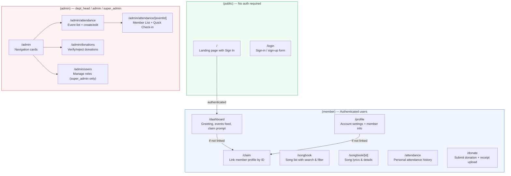
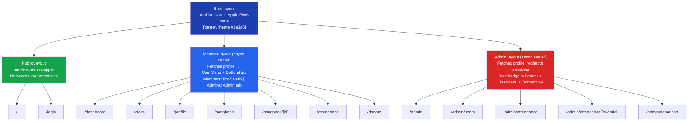
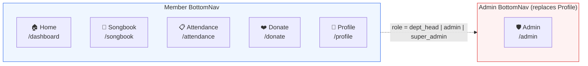
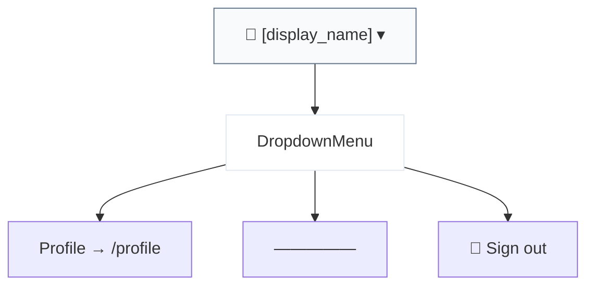

# Route Map

## All Routes

## Route Details

| Route | Auth | Roles | Layout | Status |
|-------|------|-------|--------|--------|
| `/` | Public | Any (authenticated → /dashboard) | Root | Working (landing page) |
| `/login` | Public | Any (authenticated → /dashboard) | Root > Public | Working |
| `/dashboard` | Protected | All authenticated | Root > Member | Working (greeting, events, claim, links) |
| `/claim` | Protected | All authenticated | Root > Member | Working (member ID claim) |
| `/profile` | Protected | All authenticated | Root > Member | Working (name, role, member info) |
| `/songbook` | Protected | All authenticated | Root > Member | Working (search, filter, cards) |
| `/songbook/[id]` | Protected | All authenticated | Root > Member | Working (lyrics) |
| `/attendance` | Protected | All authenticated | Root > Member | Working (history or claim prompt) |
| `/donate` | Protected | All authenticated | Root > Member | Working (form + receipt + history) |
| `/admin` | Protected | dept_head, admin, super_admin | Root > Admin | Working (nav cards) |
| `/admin/users` | Protected | super_admin only | Root > Admin | Working (role/dept management) |
| `/admin/attendance` | Protected | dept_head, admin, super_admin | Root > Admin | Working (events + create/edit) |
| `/admin/attendance/[eventId]` | Protected | dept_head, admin, super_admin | Root > Admin | Working (check-in tabs) |
| `/admin/donations` | Protected | admin, super_admin, Budget dept head | Root > Admin | Working (verify/reject) |

## Layout Hierarchy

## BottomNav Links

## Header UserMenu

