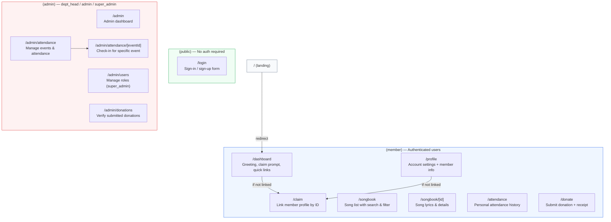
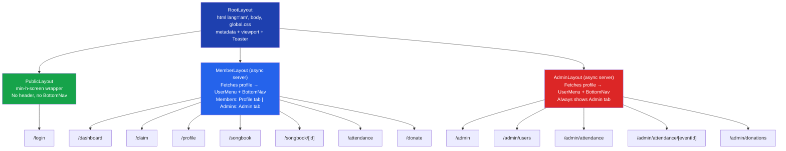
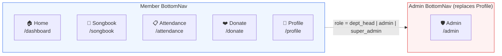
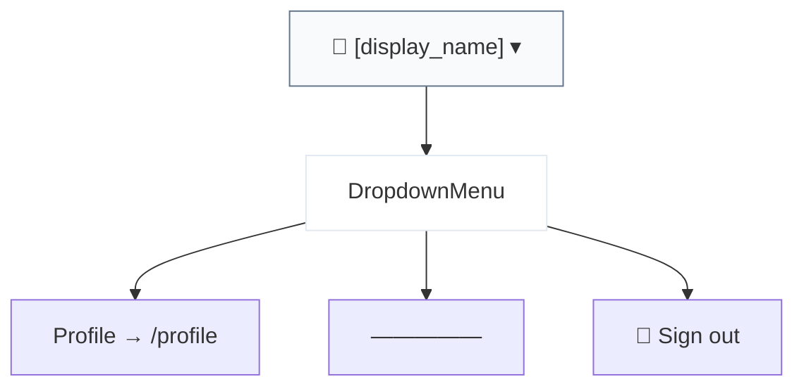

# Route Map

## All Routes

## Route Details

| Route | Auth | Roles | Layout | Status |
|-------|------|-------|--------|--------|
| `/` | Protected | Any | Root | Redirects to `/dashboard` |
| `/login` | Public | Any (logged-in users redirected to `/dashboard`) | Root > Public | Working |
| `/dashboard` | Protected | All authenticated | Root > Member | Working (greeting, claim prompt, quick links) |
| `/claim` | Protected | All authenticated | Root > Member | Working (member ID claim flow) |
| `/profile` | Protected | All authenticated | Root > Member | Working (editable name, linked member info) |
| `/songbook` | Protected | All authenticated | Root > Member | Working (search, category filter, song cards) |
| `/songbook/[id]` | Protected | All authenticated | Root > Member | Working (lyrics display) |
| `/attendance` | Protected | All authenticated | Root > Member | Placeholder |
| `/donate` | Protected | All authenticated | Root > Member | Placeholder |
| `/admin` | Protected | dept_head, admin, super_admin | Root > Admin | Placeholder |
| `/admin/users` | Protected | dept_head, admin, super_admin | Root > Admin | Placeholder |
| `/admin/attendance` | Protected | dept_head, admin, super_admin | Root > Admin | Placeholder |
| `/admin/attendance/[eventId]` | Protected | dept_head, admin, super_admin | Root > Admin | Placeholder |
| `/admin/donations` | Protected | dept_head, admin, super_admin | Root > Admin | Placeholder |

## Layout Hierarchy

## BottomNav Links

## Header UserMenu

The header replaces the old standalone LogoutButton with a DropdownMenu:

